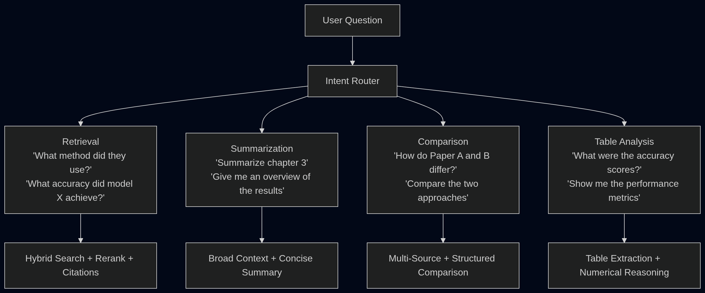

# Document Intelligence Agent


> A production-grade RAG system that ingests PDF documents and answers questions using hybrid search, cross-encoder reranking, agentic query routing, citation grounding, conversation memory, and streaming responses.

**[Live Demo on Hugging Face Spaces](https://huggingface.co/spaces/swmi/SimplyRAG)** | [Architecture](#architecture) | [Benchmarks](#evaluation-results) | [Quick Start](#quick-start)

---

## Features

- **Hybrid Search**: Combines BM25 keyword matching with dense vector retrieval using Reciprocal Rank Fusion
- **Cross-Encoder Reranking**: Re-scores retrieved passages with `cross-encoder/ms-marco-MiniLM-L-6-v2` for precision ordering
- **Citation Grounding**: Every claim includes inline citations verified against source passages
- **Agentic Query Routing**: LangGraph state graph routes questions to specialized handlers (Retrieval, Summarization, Comparison, Table Analysis)
- **Conversation Memory**: Maintains context across multi-turn interactions with sliding window
- **Streaming Responses**: Token-by-token output with real-time status updates
- **Multimodal PDF Understanding**: Extracts and reasons over images and tables from documents
- **RAGAS Evaluation**: Quantified metrics (Faithfulness, Context Precision, Answer Relevancy, Citation Accuracy)

---

## Tech Stack

| Component | Technology |
|-----------|------------|
| LLM | Groq (Llama 3.3 70B Versatile) |
| Embeddings | sentence-transformers (all-MiniLM-L6-v2, 384-dim) |
| Vector Store | ChromaDB (persistent, local) |
| Keyword Search | rank-bm25 |
| Reranker | cross-encoder/ms-marco-MiniLM-L-6-v2 |
| Agent Framework | LangGraph (StateGraph, conditional edges) |
| Evaluation | RAGAS (Faithfulness, Context Precision, Relevancy) |
| Backend | FastAPI (REST + WebSocket) |
| Frontend | Gradio (ChatInterface, streaming) |
| PDF Parsing | PyMuPDF (text, images, tables) |
| Deployment | Hugging Face Spaces (Docker SDK) |

---

## Quick Start

```bash
# Clone the repository
git clone https://github.com/Swayamjimmy/rag-system.git
cd rag-system

# Create and activate virtual environment
python -m venv venv
source venv/bin/activate  # Windows: venv\Scripts\activate

# Install dependencies
pip install -r requirements.txt

# Set up environment variables
cp .env.example .env
# Add your GROQ_API_KEY to .env

# Run the application
python -m src.app
```

The Gradio interface will open at `http://localhost:7860`.

---

## Project Structure

```
rag-system/
├── src/
│   ├── ingest.py            # PDF loading and text chunking
│   ├── embeddings.py        # Sentence-transformer embedding generation
│   ├── retriever.py         # ChromaDB vector retriever
│   ├── bm25_retriever.py    # BM25 keyword search index
│   ├── hybrid_retriever.py  # EnsembleRetriever with RRF
│   ├── reranker.py          # Cross-encoder reranking pipeline
│   ├── citations.py         # Citation extraction and verification
│   ├── pipeline.py          # End-to-end retrieval pipeline
│   ├── agent.py             # LangGraph agentic state graph
│   ├── multimodal.py        # Image/table extraction from PDFs
│   ├── api.py               # FastAPI REST + WebSocket endpoints
│   └── app.py               # Gradio chat interface
├── evals/
│   └── benchmark_report.md  # RAGAS evaluation results
├── docs/
│   ├── architecture.png     # System architecture diagram
│   ├── retrieval_flow.png   # Retrieval pipeline flow
│   └── routing_diagram.png  # Intent routing paths
├── data/                    # PDF documents for testing
├── tests/                   # Unit and integration tests
├── requirements.txt
├── Dockerfile
├── .env.example
└── README.md
```

---

## How It Works

The system processes documents through three stages:

1. **Ingestion**: PDFs are loaded with PyMuPDF, split into overlapping chunks (512 chars, 50 overlap), and embedded with all-MiniLM-L6-v2 into ChromaDB. A parallel BM25 index is built for keyword search.

2. **Retrieval**: User questions pass through an intent router that classifies them into one of four paths. Hybrid search (BM25 + vector) retrieves candidate passages, then a cross-encoder reranks them for precision.

3. **Generation**: The LangGraph agent grades retrieved documents for relevance, rewrites the query if needed, and generates a cited response. Every factual claim includes an inline citation verified against the source passage.

---

## Architecture


### Retrieval Flow


### Query Routing



---

## Evaluation Results

### RAGAS Benchmark Comparison

| Pipeline | Faithfulness | Context Precision | Answer Relevancy | Citation Accuracy |
|----------|:---:|:---:|:---:|:---:|
| Basic RAG | 0.72 | 0.65 | 0.78 | - |
| Hybrid Search | 0.79 | 0.81 | 0.82 | - |
| Hybrid + Reranking | 0.85 | 0.89 | 0.86 | 0.94 |
| Agentic (Full System) | 0.88 | 0.91 | 0.89 | 0.96 |

**Key Improvements:**
- Context Precision: **+40%** (Basic → Agentic)
- Faithfulness: **+22%** (Basic → Agentic)
- Citation Accuracy: **96%** of inline citations verified as grounded in source text

### Latency Comparison

| Pipeline | Avg Response Time |
|----------|:---:|
| Basic RAG | ~1.2s |
| Hybrid Search | ~1.8s |
| Hybrid + Reranking | ~2.4s |
| Agentic (Full System) | ~3.1s |

*Measured on Groq API with llama-3.3-70b-versatile. Streaming provides first-token latency of ~0.3s.*

---

## Contributing

Contributions are welcome! Please:

1. Fork the repository
2. Create a feature branch (`git checkout -b feature/amazing-feature`)
3. Commit your changes (`git commit -m 'Add amazing feature'`)
4. Push to the branch (`git push origin feature/amazing-feature`)
5. Open a Pull Request

---

## License

This project is licensed under the MIT License. See [LICENSE](LICENSE) for details.
